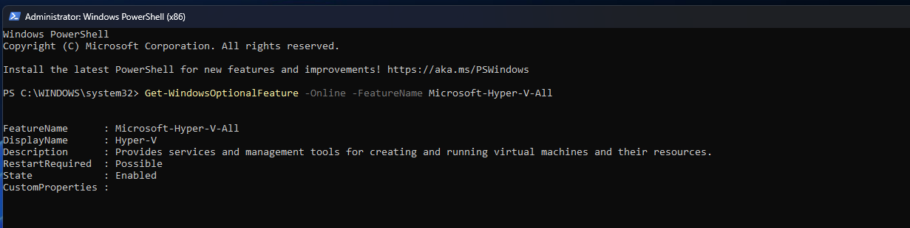
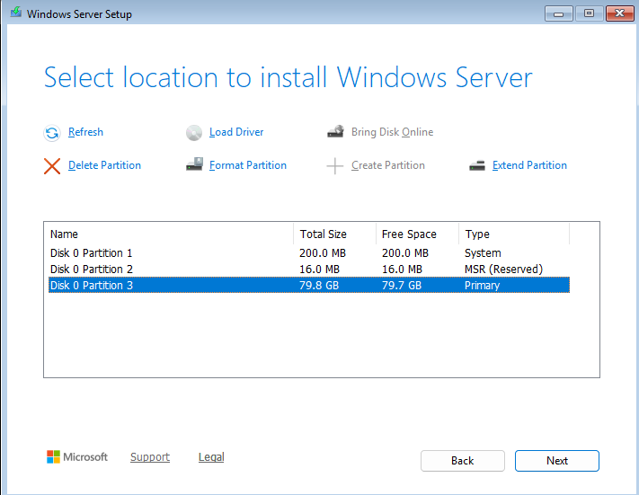
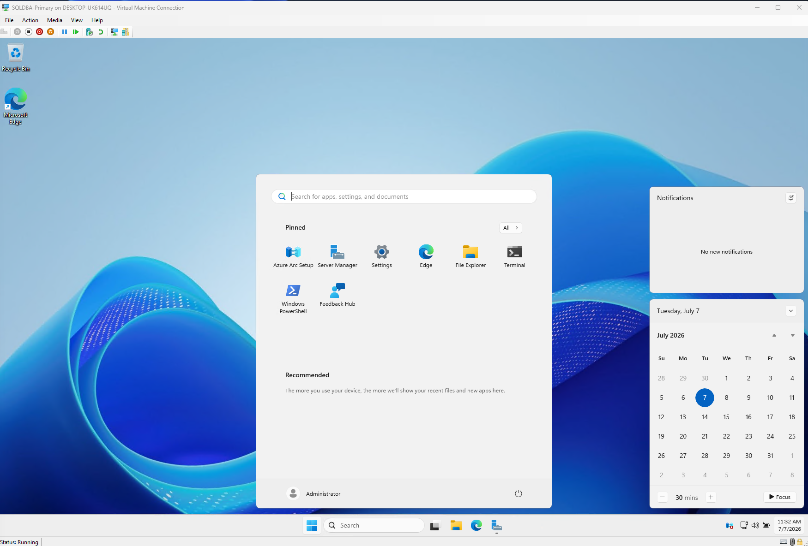
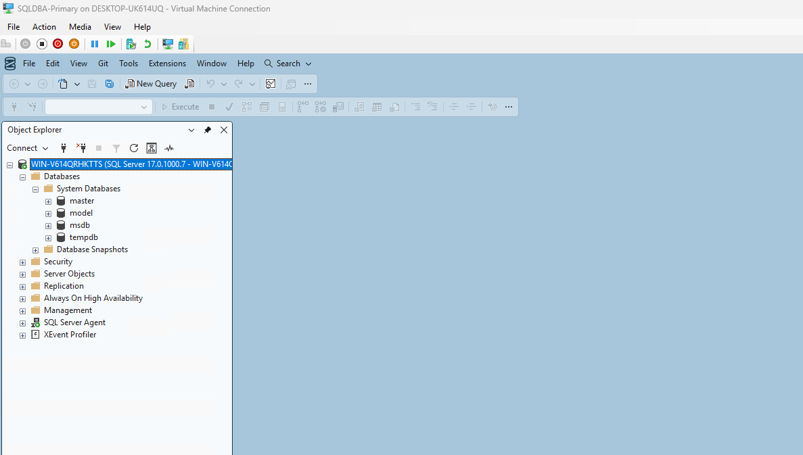

# Phase 1: Assessment & Environment Prep

**Status:** ✅ Complete

## Overview

I'm migrating a PostgreSQL database to Microsoft SQL Server 2025, and this phase covers building the infrastructure for that migration and assessing the source PostgreSQL database before I touch any schema conversion. I deliberately built the environment to support not just this migration project, but the follow-on Enterprise SQL Server DBA project I'm doing next (Always On Availability Groups, backup/recovery, security, and monitoring).

## Architecture

I run everything on a single Windows 11 Pro laptop, using Hyper-V to host an isolated Windows Server VM alongside my existing native PostgreSQL installation.


I provisioned VM1 as the future **Always On Availability Group primary replica** — I want to use the same VM for this migration that later anchors Project 2's high-availability lab, rather than rebuilding it from scratch.

## Environment Specifications

| Component | Detail |
|---|---|
| Host OS | Windows 11 Pro |
| Host RAM | 64 GB |
| Hypervisor | Hyper-V (native, no nested virtualization) |
| Virtual Switch | `SQLLab-External-Switch` (External, bound to WiFi, management OS sharing enabled) |
| VM Name | `SQLDBA-Primary` |
| VM Generation | Generation 2 (UEFI, Secure Boot) |
| VM Memory | 16 GB (Dynamic Memory enabled) |
| VM vCPUs | 8 |
| VM Disk | 80 GB dynamically-expanding VHDX |
| Guest OS | Windows Server 2025 Standard Evaluation (Desktop Experience) |
| Database Engine | SQL Server 2025 Enterprise Developer Edition |
| Instance Type | Default instance (not named) |
| Authentication Mode | Mixed Mode (SQL + Windows) |
| Management Tools | SSMS 21 + Hybrid and Migration workload |
| Source Database | PostgreSQL 18, `healthcare_dba` |

## Steps I Completed

### 1. Enabled Hyper-V on the host

I checked via PowerShell that the Hyper-V feature was available but disabled by default on Windows 11 Pro, then enabled it and restarted.



### 2. Created the virtual switch

I built `SQLLab-External-Switch` as an **External** virtual switch bound to my host's WiFi adapter, with "Allow management operating system to share this network adapter" enabled — this keeps my host's own network access working while giving the VM a real IP on my home network.

### 3. Created VM1 — `SQLDBA-Primary`

I provisioned this through the Hyper-V New Virtual Machine Wizard:
- Generation 2, 16 GB dynamic memory, 8 vCPUs, 80 GB VHDX
- Attached to `SQLLab-External-Switch`
- Boot media: Windows Server 2025 evaluation ISO

### 4. Installed Windows Server 2025 Standard (Desktop Experience)

I chose Standard edition since it fully supports Windows Server Failover Clustering and Always On AG — no need for Datacenter here. I went with Desktop Experience over Server Core so I could capture clean screenshots for this portfolio; Core is the production-typical choice, but I traded that off for documentation clarity.

I installed to the full 80 GB disk (Setup auto-created the System, MSR, and Primary partitions for me).





### 5. Verified network connectivity

- I confirmed VM1 has internet access (`ping 8.8.8.8` succeeded)
- I confirmed VM1 and my host landed on the same subnet (both `192.xxx.xxx.xxx` addresses, masked here for privacy)
- I switched VM1's network profile from `Public` to `Private`
- I enabled the "File and Printer Sharing" firewall rule group to allow inbound ICMP
- I confirmed bidirectional ping between my host and VM1

### 6. Installed SQL Server 2025 Enterprise Developer Edition

I ran a custom installation on VM1:
- **Features:** Database Engine Services, SQL Server Replication only (I excluded AI Services, Full-Text Search, PolyBase, and Analysis/Integration Services since I don't need them for this project)
- **Instance:** Default instance — a deliberate choice on my part, since each AG replica VM will host exactly one instance, so my failover evidence later will read clearly from machine names rather than instance names
- **Authentication:** Mixed Mode; I set the `sa` account and added my own Windows user as a SQL admin
- **TempDB:** 8 files, matching my 8 vCPUs (best practice)
- **MaxDOP / Memory:** I left these at installer defaults on purpose, so I have an untouched baseline to compare against in the Performance Tuning phase later
- I verified all services (`MSSQLSERVER`, `SQLSERVERAGENT`, `SQLBrowser`, `SQLWriter`) were running after install

### 7. Installed SSMS 21 and confirmed connectivity

I installed SSMS with the "Hybrid and Migration" workload, since it includes migration/assessment tooling relevant to this phase. I connected successfully to the `SQLDBA-Primary` default instance.



### 8. Assessed the PostgreSQL source database

I connected to my `healthcare_dba` PostgreSQL 18 database and ran a full inventory (see [`sql/phase-1-assessment/01_source_inventory.sql`](../sql/phase-1-assessment/01_source_inventory.sql) for every query and finding). Summary of what I found:

| Category | Detail |
|---|---|
| Schemas | 2 (`cms`, `audit`) |
| Tables | 5 |
| Rows (approx.) | ~20.5 million total |
| Size | ~5.5 GB |
| Primary keys | 4 (1 composite: `user_state_access`) |
| Foreign keys | 1 (`provider_services.rndrng_npi` → `providers.rndrng_npi`) |
| Indexes (secondary) | 8, all standard B-tree |
| Triggers | 2, both calling the same audit-logging function |
| Functions | 1 — a generic JSONB audit logger (`audit.log_data_changes()`) |
| Views | 0 |
| Sequences | 2, standard bigint identity-style |
| Extensions | 2 (`plpgsql`, `pg_stat_statements`) — neither needs migrating |
| PostgreSQL-specific types flagged | `jsonb` (2 columns), `inet` (1 column) |

The most interesting conversion challenge I found is the audit trigger function: it serializes entire rows to JSONB using `to_jsonb(OLD)`/`to_jsonb(NEW)` and PostgreSQL's dynamic trigger metadata (`TG_TABLE_NAME`, `TG_OP`). I'll need to rebuild this generic, table-agnostic pattern in T-SQL using SQL Server 2025's native `JSON` type and `FOR JSON PATH` against the `inserted`/`deleted` pseudo-tables in the Schema Conversion phase.

I also noticed `cms.staging_raw` stores almost every column — even numeric ones — as `character varying`, which tells me it's a raw landing table ahead of cleanup into `providers`/`provider_services`, rather than a real relational table. I still need to decide whether it's worth migrating at all, or whether it's disposable ETL scaffolding I can leave behind.

## Migration Tooling Decision

Before starting schema conversion, I had to decide how I was actually going to move this database: **SQL Server Migration Assistant (SSMA)** or a **custom scripted approach**.

My original plan was to use SSMA for PostgreSQL, since it's Microsoft's own free migration tool. When I went to download it, I found that Microsoft's current SQL Server Migration Assistant documentation only lists five supported sources: **Access, Db2, MySQL, Oracle, and SAP ASE**. PostgreSQL isn't one of them. A number of third-party migration blogs still describe "SSMA for PostgreSQL" as if it's currently available, but none of them link to a working, current Microsoft download for it — that content looks outdated, and Microsoft's own current source list doesn't include PostgreSQL at all.

Given that, I decided to go with a **custom scripted migration**: I'll hand-write the T-SQL DDL based on my inventory above, and build my own ETL (Python with `psycopg2` and `pyodbc`) to move the data. This is a very manageable scope for my schema — 5 tables, 1 foreign key, one custom trigger/function, and mostly standard data types — and it also demonstrates more hands-on schema-conversion and ETL skill for this portfolio than clicking through a GUI wizard would have.

## Repository & Evidence

I'm tracking all of this in [`sqlserver-postgresql-migration`](https://github.com/aryobeen007/sqlserver-postgresql-migration), organized by phase:

```
sqlserver-postgresql-migration/
├── sql/phase-1-assessment/   ← inventory script
├── docs/                     ← this file
├── diagrams/
├── screenshots/              ← 01-04 captured
└── backups/
```

## What's Next: Phase 2 — Schema Conversion

- [ ] Write T-SQL DDL for `cms.providers`, `cms.provider_services`, `cms.user_state_access`, and `audit.data_access_log` (decide whether to bring over `cms.staging_raw`)
- [ ] Map PostgreSQL types to T-SQL equivalents (`character varying` → `NVARCHAR`, `jsonb` → `JSON`, `inet` → `VARCHAR(45)`, `bigint` sequences → `IDENTITY(1,1)`)
- [ ] Recreate primary keys, the one foreign key, and all 8 secondary indexes
- [ ] Rewrite `audit.log_data_changes()` as a T-SQL trigger using `FOR JSON PATH` against `inserted`/`deleted`
- [ ] Document every mapping decision in an object-mapping matrix
