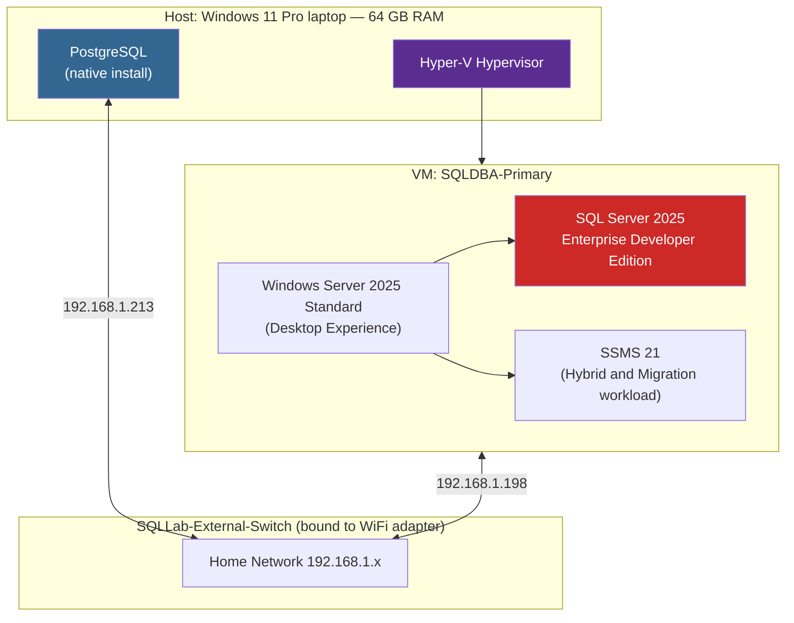

# Phase 1: Assessment & Environment Prep

**Status:** 🟡 In Progress — environment build complete, PostgreSQL source assessment pending

## Overview

This phase establishes the infrastructure needed to migrate a PostgreSQL database to Microsoft SQL Server 2025, and will assess the source PostgreSQL database before any schema conversion begins. The environment is intentionally built to support not just this migration project, but the follow-on Enterprise SQL Server DBA project (Always On Availability Groups, backup/recovery, security, and monitoring).

## Architecture

The environment runs entirely on a single Windows 11 Pro laptop, using Hyper-V to host an isolated Windows Server VM alongside the existing native PostgreSQL installation.



VM1 is provisioned as the future **Always On Availability Group primary replica** — the same VM used for this migration will later anchor Project 2's high-availability lab, rather than being rebuilt from scratch.

## Environment Specifications

| Component | Detail |
|---|---|
| Host OS | Windows 11 Pro |
| Host RAM | 64 GB |
| Hypervisor | Hyper-V (native, no nested virtualization) |
| Virtual Switch | `SQLLab-External-Switch` (External, bound to WiFi, management OS sharing enabled) |
| VM Name | `SQLDBA-Primary` |
| VM Generation | Generation 2 (UEFI, Secure Boot) |
| VM Memory | 16 GB (Dynamic Memory enabled) |
| VM vCPUs | 8 |
| VM Disk | 80 GB dynamically-expanding VHDX |
| Guest OS | Windows Server 2025 Standard Evaluation (Desktop Experience) |
| Database Engine | SQL Server 2025 Enterprise Developer Edition |
| Instance Type | Default instance (not named) |
| Authentication Mode | Mixed Mode (SQL + Windows) |
| Management Tools | SSMS 21 + Hybrid and Migration workload |

## Steps Completed

### 1. Enabled Hyper-V on the host

Verified via PowerShell that the Hyper-V feature was available but disabled by default on Windows 11 Pro, then enabled it and restarted.


### 2. Created the virtual switch

Built `SQLLab-External-Switch` as an **External** virtual switch bound to the host's WiFi adapter, with "Allow management operating system to share this network adapter" enabled — this keeps the host's own network access working while giving VMs a real IP on the home network.

### 3. Created VM1 — `SQLDBA-Primary`

Provisioned via the Hyper-V New Virtual Machine Wizard:
- Generation 2, 16 GB dynamic memory, 8 vCPUs, 80 GB VHDX
- Attached to `SQLLab-External-Switch`
- Boot media: Windows Server 2025 evaluation ISO

### 4. Installed Windows Server 2025 Standard (Desktop Experience)

Chose Standard edition (fully supports Windows Server Failover Clustering and Always On AG — no need for Datacenter) and Desktop Experience (GUI retained to support clean screenshots for this portfolio; Server Core is the production-typical choice but was traded off here for documentation clarity).

Installed to the full 80 GB disk (Setup auto-created System, MSR, and Primary partitions).


### 5. Verified network connectivity

- VM1 confirmed with internet access (`ping 8.8.8.8` succeeded)
- VM1 assigned `192.168.1.198`; host's switch-bound adapter at `192.168.1.213` — same subnet
- Switched VM1's network profile from `Public` to `Private`
- Enabled the "File and Printer Sharing" firewall rule group to allow inbound ICMP
- Confirmed bidirectional ping between host and VM1

### 6. Installed SQL Server 2025 Enterprise Developer Edition

Custom installation on VM1:
- **Features:** Database Engine Services, SQL Server Replication only (AI Services, Full-Text Search, PolyBase, Analysis/Integration Services excluded — not needed for this project)
- **Instance:** Default instance (deliberate choice — each AG replica VM hosts exactly one instance, so failover evidence reads clearly from machine names rather than instance names)
- **Authentication:** Mixed Mode, `sa` account configured, current Windows user added as SQL admin
- **TempDB:** 8 files (matches 8 vCPUs — best practice)
- **MaxDOP / Memory:** left at installer defaults intentionally, to preserve an untouched baseline for the Performance Tuning phase later
- Verified all services (`MSSQLSERVER`, `SQLSERVERAGENT`, `SQLBrowser`, `SQLWriter`) running post-install

### 7. Installed SSMS 21 and confirmed connectivity

Installed with the "Hybrid and Migration" workload (includes migration/assessment tooling relevant to this phase). Connected successfully to the `SQLDBA-Primary` default instance.


## Repository & Evidence

All work is tracked in [`sqlserver-postgresql-migration`](https://github.com/aryobeen007/sqlserver-postgresql-migration), organized by phase:

```
sqlserver-postgresql-migration/
├── sql/phase-1-assessment/   ← inventory scripts land here next
├── docs/                     ← this file
├── diagrams/
├── screenshots/              ← 01-04 captured so far
└── backups/
```

## Next Steps (Remainder of Phase 1)

- [ ] Confirm PostgreSQL source is reachable from VM1 / host
- [ ] Inventory PostgreSQL schema: tables, columns, data types, PK/FK, constraints, indexes, views, functions, triggers, sequences
- [ ] Capture row counts and sizing per table (`pg_total_relation_size`, `pg_stat_user_tables`)
- [ ] Flag PostgreSQL-specific features with no direct SQL Server equivalent (arrays, JSONB, custom types, extensions, etc.)
- [ ] Decide on migration tooling (SSMA for PostgreSQL vs. custom scripted ETL) and document the trade-off
- [ ] Produce the assessment report and tooling decision doc
