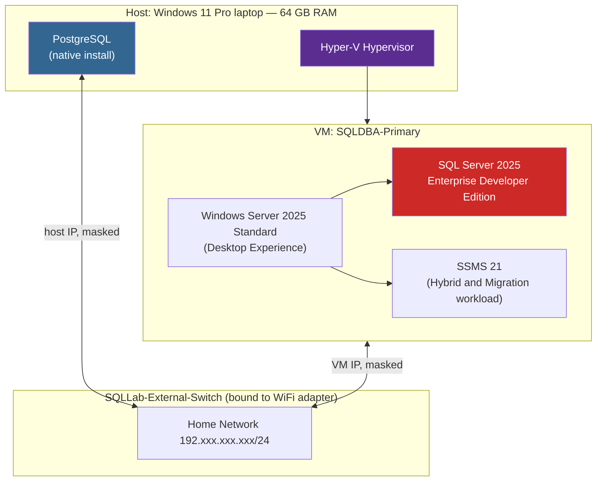

# Phase 1: Assessment & Environment Prep

**Status:** 🟡 In Progress — environment build complete, PostgreSQL source assessment pending

## Overview

I'm migrating a PostgreSQL database to Microsoft SQL Server 2025, and this phase covers building the infrastructure for that migration and assessing the source PostgreSQL database before I touch any schema conversion. I deliberately built the environment to support not just this migration project, but the follow-on Enterprise SQL Server DBA project I'm doing next (Always On Availability Groups, backup/recovery, security, and monitoring).

## Architecture

I run everything on a single Windows 11 Pro laptop, using Hyper-V to host an isolated Windows Server VM alongside my existing native PostgreSQL installation.



I provisioned VM1 as the future **Always On Availability Group primary replica** — I want to use the same VM for this migration that later anchors Project 2's high-availability lab, rather than rebuilding it from scratch.

## Environment Specifications

| Component | Detail |
|---|---|
| Host OS | Windows 11 Pro |
| Host RAM | 64 GB |
| Hypervisor | Hyper-V (native, no nested virtualization) |
| Virtual Switch | `SQLLab-External-Switch` (External, bound to WiFi, management OS sharing enabled) |
| VM Name | `SQLDBA-Primary` |
| VM Generation | Generation 2 (UEFI, Secure Boot) |
| VM Memory | 16 GB (Dynamic Memory enabled) |
| VM vCPUs | 8 |
| VM Disk | 80 GB dynamically-expanding VHDX |
| Guest OS | Windows Server 2025 Standard Evaluation (Desktop Experience) |
| Database Engine | SQL Server 2025 Enterprise Developer Edition |
| Instance Type | Default instance (not named) |
| Authentication Mode | Mixed Mode (SQL + Windows) |
| Management Tools | SSMS 21 + Hybrid and Migration workload |

## Steps I Completed

### 1. Enabled Hyper-V on the host

I checked via PowerShell that the Hyper-V feature was available but disabled by default on Windows 11 Pro, then enabled it and restarted.


### 2. Created the virtual switch

I built `SQLLab-External-Switch` as an **External** virtual switch bound to my host's WiFi adapter, with "Allow management operating system to share this network adapter" enabled — this keeps my host's own network access working while giving the VM a real IP on my home network.

### 3. Created VM1 — `SQLDBA-Primary`

I provisioned this through the Hyper-V New Virtual Machine Wizard:
- Generation 2, 16 GB dynamic memory, 8 vCPUs, 80 GB VHDX
- Attached to `SQLLab-External-Switch`
- Boot media: Windows Server 2025 evaluation ISO

### 4. Installed Windows Server 2025 Standard (Desktop Experience)

I chose Standard edition since it fully supports Windows Server Failover Clustering and Always On AG — no need for Datacenter here. I went with Desktop Experience over Server Core so I could capture clean screenshots for this portfolio; Core is the production-typical choice, but I traded that off for documentation clarity.

I installed to the full 80 GB disk (Setup auto-created the System, MSR, and Primary partitions for me).


### 5. Verified network connectivity

- I confirmed VM1 has internet access (`ping 8.8.8.8` succeeded)
- I confirmed VM1 and my host landed on the same subnet (both `192.xxx.xxx.xxx` addresses, masked here for privacy)
- I switched VM1's network profile from `Public` to `Private`
- I enabled the "File and Printer Sharing" firewall rule group to allow inbound ICMP
- I confirmed bidirectional ping between my host and VM1

### 6. Installed SQL Server 2025 Enterprise Developer Edition

I ran a custom installation on VM1:
- **Features:** Database Engine Services, SQL Server Replication only (I excluded AI Services, Full-Text Search, PolyBase, and Analysis/Integration Services since I don't need them for this project)
- **Instance:** Default instance — a deliberate choice on my part, since each AG replica VM will host exactly one instance, so my failover evidence later will read clearly from machine names rather than instance names
- **Authentication:** Mixed Mode; I set the `sa` account and added my own Windows user as a SQL admin
- **TempDB:** 8 files, matching my 8 vCPUs (best practice)
- **MaxDOP / Memory:** I left these at installer defaults on purpose, so I have an untouched baseline to compare against in the Performance Tuning phase later
- I verified all services (`MSSQLSERVER`, `SQLSERVERAGENT`, `SQLBrowser`, `SQLWriter`) were running after install

### 7. Installed SSMS 21 and confirmed connectivity

I installed SSMS with the "Hybrid and Migration" workload, since it includes migration/assessment tooling relevant to this phase. I connected successfully to the `SQLDBA-Primary` default instance.


## Repository & Evidence

I'm tracking all of this in [`sqlserver-postgresql-migration`](https://github.com/aryobeen007/sqlserver-postgresql-migration), organized by phase:

```
sqlserver-postgresql-migration/
├── sql/phase-1-assessment/   ← inventory scripts land here next
├── docs/                     ← this file
├── diagrams/
├── screenshots/              ← 01-04 captured so far
└── backups/
```

## What's Next (Remainder of Phase 1)

- [ ] Confirm I can reach my PostgreSQL source from VM1 / host
- [ ] Inventory the PostgreSQL schema: tables, columns, data types, PK/FK, constraints, indexes, views, functions, triggers, sequences
- [ ] Capture row counts and sizing per table (`pg_total_relation_size`, `pg_stat_user_tables`)
- [ ] Flag PostgreSQL-specific features with no direct SQL Server equivalent (arrays, JSONB, custom types, extensions, etc.)
- [ ] Decide on migration tooling (SSMA for PostgreSQL vs. a custom scripted ETL) and document my reasoning
- [ ] Write up the assessment report and tooling decision doc
