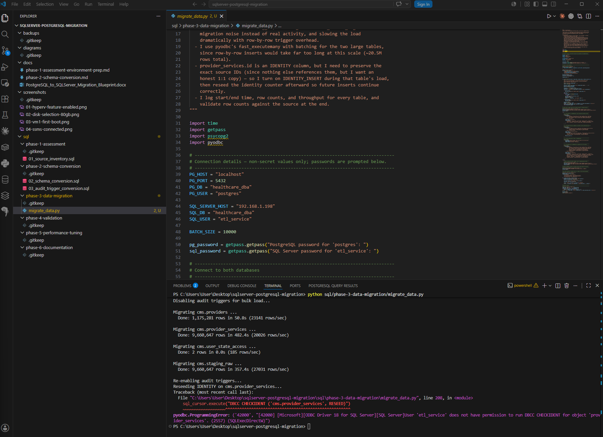
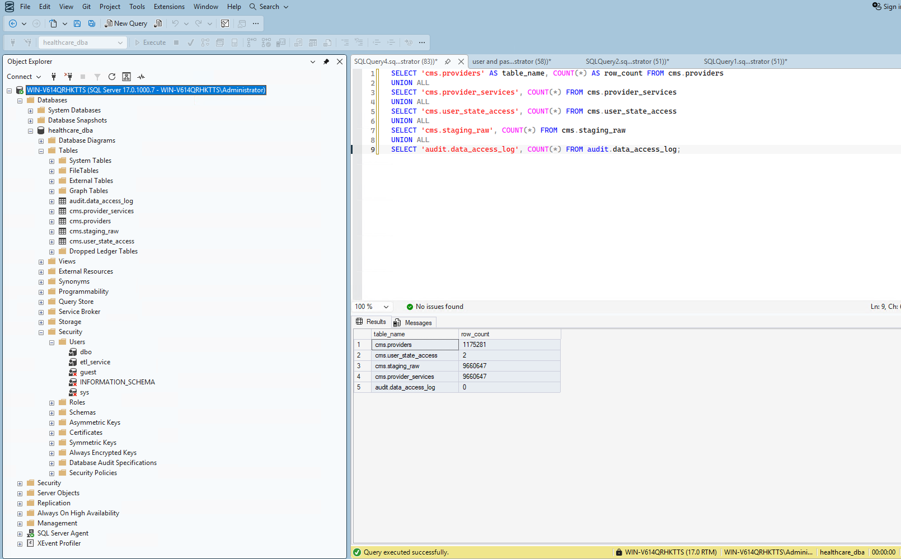

# Phase 3: Data Migration

**Status:** ✅ Complete

## Overview

With the schema converted in Phase 2, I built a Python ETL script to move all the data from PostgreSQL into the new SQL Server schema — roughly 20.5 million rows across four tables — and validated every row count against the source afterward.

## Why a Custom Script

I confirmed in Phase 1 that SSMA doesn't support PostgreSQL as a migration source, so I wrote my own ETL using `psycopg2` (PostgreSQL) and `pyodbc` (SQL Server), with `fast_executemany` and batching to handle the scale involved.

## A Problem I Had to Solve First

Before writing the load logic, I realized the audit triggers I built in Phase 2 would fire on every single row inserted into `cms.providers` and `cms.provider_services` — roughly 10.8 million rows combined. Left unhandled, that would have:

- Flooded `audit.data_access_log` with migration noise instead of real activity
- Slowed the load dramatically from row-by-row trigger overhead

I solved this by disabling both triggers immediately before the bulk load and re-enabling them right after, wrapped in a `try/finally` block so they get re-enabled even if the migration fails partway through.

## Steps I Completed

### 1. Set up the ETL environment

- Installed `psycopg2-binary` and `pyodbc` via pip
- Installed the **ODBC Driver 18 for SQL Server** (the legacy `SQL Server` driver was already present, but I wanted the current, more reliable one)
- Created a dedicated `etl_service` SQL login, scoped to `db_datareader`/`db_datawriter` on `healthcare_dba` only — deliberately avoiding the `sa` account for routine ETL work, since that's a least-privilege best practice worth carrying into the DBA project's Security phase

### 2. Troubleshot connectivity

Getting the script to actually connect took a few real fixes, each worth noting since they're realistic DBA troubleshooting, not just script bugs:

| Problem | Cause | Fix |
|---|---|---|
| `Login timeout expired` / error 1326 | TCP/IP protocol was disabled in SQL Server Configuration Manager by default | Enabled TCP/IP, restarted the SQL Server service |
| Still couldn't connect after enabling TCP/IP | No Windows Firewall rule existed for port 1433 | Created an inbound rule: `New-NetFirewallRule -DisplayName "SQL Server (TCP 1433)" -Direction Inbound -LocalPort 1433 -Protocol TCP -Action Allow` |
| `Login failed for user 'etl_service'` | Typo when entering the password at the interactive prompt (confirmed by testing the same credentials successfully in both SSMS and a manual Python connection test) | Re-ran carefully with the correct password |
| `Cannot find the object "providers"` when disabling triggers | `db_datawriter`/`db_datareader` don't include `ALTER` permission, which `DISABLE TRIGGER` requires | Granted `ALTER` on just the two tables that needed it: `GRANT ALTER ON cms.providers TO etl_service;` (and same for `provider_services`) |
| `DBCC CHECKIDENT` permission denied | Identity reseeding needs elevated permission beyond what `etl_service` needs day-to-day | Ran the one-time reseed manually in SSMS under my own admin account instead of widening the service account's permissions |

### 3. Ran the migration



| Table | Rows Migrated | Time | Throughput |
|---|---|---|---|
| `cms.providers` | 1,175,281 | 50.8s | ~23,141 rows/sec |
| `cms.provider_services` | 9,660,647 | 482.4s | ~20,026 rows/sec |
| `cms.user_state_access` | 2 | <0.1s | — |
| `cms.staging_raw` | 9,660,647 | 357.4s | ~27,031 rows/sec |
| **Total** | **~20.5 million** | **~14.8 minutes** | — |

### 4. Reseeded the IDENTITY column

Since I preserved the exact source `id` values on `cms.provider_services` using `IDENTITY_INSERT`, I reseeded the identity counter afterward so future inserts continue from the correct point:

```sql
DBCC CHECKIDENT ('cms.provider_services', RESEED);
```

Confirmed: current identity value `9,660,647`, matching the last row loaded.

### 5. Validated row counts



| Table | Row Count |
|---|---|
| `cms.providers` | 1,175,281 |
| `cms.provider_services` | 9,660,647 |
| `cms.user_state_access` | 2 |
| `cms.staging_raw` | 9,660,647 |
| `audit.data_access_log` | **0** |

Every table matches the source exactly. `audit.data_access_log` reading exactly 0 is the proof the trigger-disable step worked — the migration itself generated zero audit noise, leaving the table clean for genuine activity going forward.

## Decision: Audit History

I decided not to carry over the 2 pre-existing PostgreSQL audit rows — the SQL Server audit table starts fresh from this point forward, since those 2 rows were trivial and not meaningfully useful history to preserve.

## Repository & Evidence

```
sqlserver-postgresql-migration/
├── sql/phase-3-data-migration/
│   └── migrate_data.py          ← ETL script
├── docs/                         ← this file
├── screenshots/
│   ├── 05-etl-migration-output.png
│   └── 06-migration-row-count-validation.png
```

## What's Next: Phase 4 — Validation & Integrity Testing

- [ ] Checksum/hash comparison between source and target (beyond row counts)
- [ ] Verify constraint and FK enforcement by attempting invalid inserts
- [ ] Re-run representative application queries on both systems and diff the results
- [ ] Spot-check NULL handling, default values, and any data-type edge cases (especially the `numeric` → `DECIMAL` precision choices from Phase 2)
- [ ] Confirm the audit triggers still fire correctly on live data now that migration is complete (a quick re-test, since bulk load bypassed them entirely)
