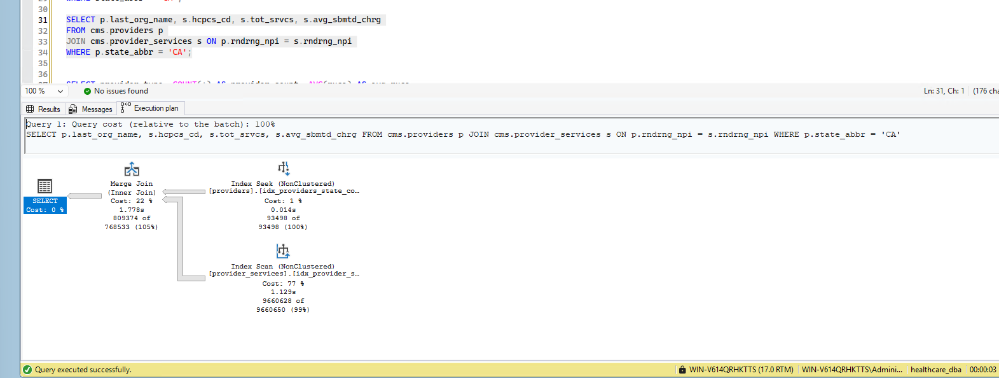

# Phase 5: Performance Baseline & Tuning

**Status:** ✅ Complete

## Overview

I picked six representative queries covering different real-world access patterns — a point lookup, a filtered join, a group-by aggregation, a join with aggregation, a filtered range scan, and a heavy join+aggregation+sort — and baselined every one against both PostgreSQL and SQL Server. Where SQL Server came out slower, I investigated and either fixed it or documented why it couldn't be fixed.

## The Six Queries

| Query | Pattern |
|---|---|
| Q1 | Point lookup — single provider by primary key |
| Q2 | Join + filter — all service lines for providers in one state |
| Q3 | Group-by aggregation — provider counts and average RUCA by provider type |
| Q4 | Join + group-by aggregation — total services and avg charge by state |
| Q5 | Filtered range scan — evaluation & management codes with high volume |
| Q6 | Heavy join + aggregation + sort — top 20 providers by estimated Medicare payment |

See [`sql/phase-5-performance-tuning/07_baseline_postgresql.sql`](../sql/phase-5-performance-tuning/07_baseline_postgresql.sql) and [`07_baseline_sqlserver.sql`](../sql/phase-5-performance-tuning/07_baseline_sqlserver.sql) for the full query text.

## Baseline Results

| Query | PostgreSQL | SQL Server (baseline) | Faster |
|---|---|---|---|
| Q1 — Point lookup | 13.2 ms | 50 ms | PostgreSQL |
| Q2 — Join + filter | 1,969.7 ms | 3,582 ms | PostgreSQL |
| Q3 — Group-by aggregation | 162.2 ms | 109 ms | SQL Server |
| Q4 — Join + group-by aggregation | 1,515.0 ms | 967 ms | SQL Server |
| Q5 — Filtered range scan | 467.3 ms | 316 ms | SQL Server |
| Q6 — Heavy join + aggregation + sort | 6,096.4 ms | 2,051 ms | SQL Server |

SQL Server won comfortably on the four heavier queries (Q3–Q6), likely from parallelizing work across the VM's 8 vCPUs — several of these showed CPU time several times higher than elapsed time, a clear sign of parallel execution. PostgreSQL won on Q1 (a trivial point lookup, where SQL Server's ~50ms looked like plan-compile overhead rather than a real issue) and Q2, which I investigated in depth below.

## Investigating Q2

Q2 — filtering providers by state and joining to their services — was SQL Server's one real regression: nearly 2x slower than PostgreSQL (3,582ms vs. 1,969.7ms). I treated this as a genuine tuning problem rather than noise.

**First look at the plan** showed SQL Server doing a full Clustered Index Scan across all 9,660,650 rows of `cms.provider_services` (74% of query cost) — even though I'd already built `idx_providers_state` back in Phase 2. SQL Server's own "Missing Index" suggestion pointed at a *covering* index that would let it avoid a key lookup back to the clustered index.

I tried four different approaches to fix this, in order:

1. **Covering index on `cms.providers`** (`state_abbr` INCLUDE `last_org_name`) — this got `providers` down to a fast Index Seek (0.014s, 1% of cost), but `provider_services` was still doing a full scan. Elapsed time barely moved (3,484ms).
2. **Forced loop join** (`OPTION (FORCE ORDER, LOOP JOIN)`) — this made things *worse* (3,614ms). The plan showed why: a Key Lookup back to the clustered index, run ~809,374 times, cost 85% of the query — more expensive than the original full scan it was meant to avoid.
3. **Covering index on `cms.provider_services`** (`rndrng_npi` INCLUDE `hcpcs_cd, tot_srvcs, avg_sbmtd_chrg`) — the optimizer switched to a Merge Join, but a merge join needs sorted input, so it just did an Index Scan across nearly the whole table again (9,660,628 of 9,660,650 rows). Elapsed time: 3,711ms — no better.
4. **Filtered index on `cms.providers`** (`WHERE state_abbr = 'CA'`) — the `providers` side was already essentially free, so this gave the optimizer nothing new to improve. Elapsed time: 3,514ms — unchanged.



**Conclusion:** all four attempts landed in the same ~3,480–3,710ms range. This isn't an indexing gap — it's structural. `cms.provider_services` has no `state_abbr` column of its own, so matching any single state means touching a meaningful, scattered fraction of a 9.66M-row table (roughly 8% of providers match `state_abbr = 'CA'`, and their service rows are spread across the table's entire physical order, since it's clustered by `id`, not by provider). No index on either table changes that underlying reality. I'm documenting this as a genuine, defensible finding rather than forcing an artificial "fix" — real performance tuning sometimes concludes that the right answer is "this is the actual cost of the query against this schema," and a denormalization (e.g., duplicating `state_abbr` onto `provider_services`) would be the real lever if this query needed to be faster — a legitimate trade-off for a future iteration, not something to force into this pass.

## Summary

| Metric | Result |
|---|---|
| Queries baselined | 6, covering point lookup, joins, aggregation, filtering, and heavy sort |
| SQL Server faster | 4 of 6 (Q3, Q4, Q5, Q6) — parallelism advantage on heavier queries |
| PostgreSQL faster | 2 of 6 (Q1, Q2) |
| Tuning attempts on Q2 | 4 (covering index x2, forced loop join, filtered index) |
| Outcome | Confirmed structural bottleneck, not a missing index — documented rather than forced |

## Repository & Evidence

```
sqlserver-postgresql-migration/
├── sql/phase-5-performance-tuning/
│   ├── 07_baseline_postgresql.sql
│   └── 07_baseline_sqlserver.sql
├── docs/                                      ← this file
├── screenshots/
│   └── 07-q2-execution-plan-bottleneck.png
```

## What's Next: Phase 6 — Documentation & Portfolio Packaging

- [ ] Write the overview-page copy: goal, stat tiles, tech tags
- [ ] Create a before/after architecture diagram (PostgreSQL source → SQL Server target)
- [ ] Compile the full challenges-and-lessons-learned narrative across all 5 phases
- [ ] Finalize repo structure and README
- [ ] Package the six phase docs into a cohesive portfolio piece, matching the site's existing project format
